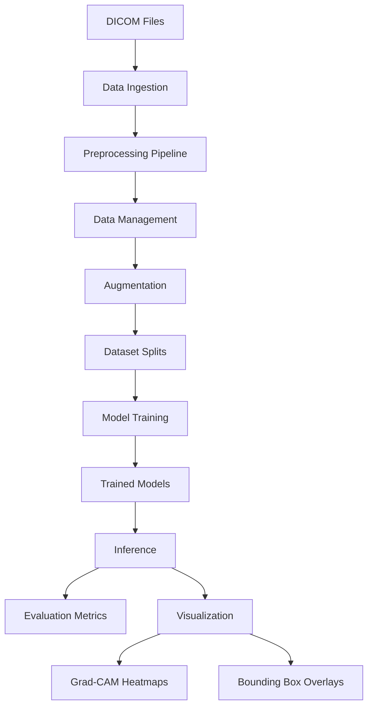

# Design Document: Chest X-ray Analysis System

## Overview

The chest X-ray analysis system is a comprehensive medical imaging pipeline that processes DICOM files through standardized preprocessing, trains deep learning models for classification and detection tasks, and provides interpretable visualizations of model predictions. The system is designed with modularity in mind, separating concerns between data preprocessing, model training, inference, and visualization.

The architecture follows a pipeline pattern where each stage can be configured independently. This allows researchers to experiment with different preprocessing techniques, model architectures, and evaluation strategies without modifying core system logic.

## Architecture

The system consists of five major subsystems:

1. **Data Ingestion Layer**: Handles DICOM file loading, format conversion, and metadata extraction
2. **Preprocessing Pipeline**: Applies a configurable sequence of image transformations
3. **Data Management Layer**: Manages dataset splitting, annotation conversion, and augmentation
4. **Model Training Layer**: Supports both classification and detection model training with transfer learning
5. **Evaluation and Visualization Layer**: Computes metrics and generates interpretable outputs



## Components and Interfaces

### 1. DICOM Loader

**Responsibility**: Load and convert DICOM medical images to standard formats

**Interface**:
```python
class DICOMLoader:
    def load_dicom(self, filepath: str) -> DICOMImage:
        """Load DICOM file and extract pixel data and metadata"""
        
    def convert_to_png(self, dicom_image: DICOMImage, output_path: str) -> None:
        """Convert DICOM pixel data to PNG format"""
        
    def extract_frames(self, dicom_image: DICOMImage) -> List[np.ndarray]:
        """Extract individual frames from multi-frame DICOM"""
```

**Key Design Decisions**:
- Use `pydicom` library for DICOM parsing
- Preserve original bit depth information in metadata
- Handle both single-frame and multi-frame DICOM files
- Validate DICOM files before processing

### 2. Image Preprocessor

**Responsibility**: Apply standardized preprocessing transformations to images

**Interface**:
```python
class ImagePreprocessor:
    def __init__(self, config: PreprocessingConfig):
        """Initialize with preprocessing configuration"""
        
    def to_grayscale(self, image: np.ndarray) -> np.ndarray:
        """Convert image to grayscale"""
        
    def resize(self, image: np.ndarray, target_size: Tuple[int, int]) -> np.ndarray:
        """Resize image to target dimensions"""
        
    def normalize(self, image: np.ndarray, method: str) -> np.ndarray:
        """Normalize pixel intensities using minmax or z-score"""
        
    def apply_clahe(self, image: np.ndarray, clip_limit: float, tile_size: int) -> np.ndarray:
        """Apply CLAHE contrast enhancement"""
        
    def denoise(self, image: np.ndarray, method: str, kernel_size: int) -> np.ndarray:
        """Apply denoising filter"""
        
    def crop_borders(self, image: np.ndarray, threshold: int) -> np.ndarray:
        """Detect and crop black borders"""
        
    def pad_to_size(self, image: np.ndarray, target_size: Tuple[int, int]) -> np.ndarray:
        """Pad image to uniform dimensions"""
        
    def process(self, image: np.ndarray) -> np.ndarray:
        """Apply full preprocessing pipeline"""
```

**Key Design Decisions**:
- Use OpenCV for image operations (efficient and well-tested)
- Chain operations in a configurable pipeline
- Preserve intermediate results for debugging
- Use high-quality interpolation (INTER_CUBIC for upsampling, INTER_AREA for downsampling)

### 3. Annotation Converter

**Responsibility**: Convert between different annotation formats

**Interface**:
```python
class AnnotationConverter:
    def parse_yolo(self, annotation_path: str, image_width: int, image_height: int) -> List[BoundingBox]:
        """Parse YOLO format annotations"""
        
    def parse_coco(self, annotation_path: str) -> Dict[int, List[BoundingBox]]:
        """Parse COCO format annotations"""
        
    def to_yolo(self, bboxes: List[BoundingBox], image_width: int, image_height: int) -> str:
        """Convert bounding boxes to YOLO format"""
        
    def to_coco(self, annotations: Dict[int, List[BoundingBox]], categories: List[str]) -> Dict:
        """Convert bounding boxes to COCO format"""
```

**Key Design Decisions**:
- YOLO format: normalized coordinates (x_center, y_center, width, height) relative to image dimensions
- COCO format: absolute coordinates (x_min, y_min, width, height) in pixels
- Validate coordinate ranges during conversion
- Support multi-class annotations

### 4. Data Augmentor

**Responsibility**: Apply safe augmentations for medical images

**Interface**:
```python
class MedicalAugmentor:
    def __init__(self, config: AugmentationConfig):
        """Initialize with augmentation configuration"""
        
    def horizontal_flip(self, image: np.ndarray, bboxes: List[BoundingBox]) -> Tuple[np.ndarray, List[BoundingBox]]:
        """Apply horizontal flip"""
        
    def rotate(self, image: np.ndarray, angle: float, bboxes: List[BoundingBox]) -> Tuple[np.ndarray, List[BoundingBox]]:
        """Apply small rotation within safe range"""
        
    def adjust_contrast(self, image: np.ndarray, factor: float) -> np.ndarray:
        """Adjust image contrast"""
        
    def zoom(self, image: np.ndarray, factor: float, bboxes: List[BoundingBox]) -> Tuple[np.ndarray, List[BoundingBox]]:
        """Apply mild zoom"""
        
    def elastic_deform(self, image: np.ndarray, alpha: float, sigma: float) -> np.ndarray:
        """Apply mild elastic deformation"""
        
    def augment(self, image: np.ndarray, bboxes: List[BoundingBox]) -> Tuple[np.ndarray, List[BoundingBox]]:
        """Apply random augmentation pipeline"""
```

**Key Design Decisions**:
- Use `albumentations` library for efficient augmentation
- Restrict rotation to ±10 degrees (medically safe)
- Never apply vertical flips (anatomically incorrect)
- Transform bounding boxes along with images
- Apply augmentations probabilistically during training

### 5. Dataset Manager

**Responsibility**: Manage dataset splitting and organization

**Interface**:
```python
class DatasetManager:
    def split_dataset(self, 
                     image_paths: List[str], 
                     labels: List[int],
                     train_ratio: float,
                     val_ratio: float,
                     test_ratio: float,
                     stratify: bool = True,
                     patient_ids: Optional[List[str]] = None) -> DatasetSplit:
        """Split dataset into train/val/test sets"""
        
    def create_data_loaders(self, 
                           dataset_split: DatasetSplit,
                           batch_size: int,
                           num_workers: int) -> Tuple[DataLoader, DataLoader, DataLoader]:
        """Create PyTorch data loaders"""
```

**Key Design Decisions**:
- Support stratified splitting to maintain class balance
- Support patient-level splitting to prevent data leakage
- Use PyTorch DataLoader for efficient batching
- Implement custom Dataset classes for medical images

### 6. Classification Model

**Responsibility**: Train and evaluate classification models

**Interface**:
```python
class ChestXrayClassifier:
    def __init__(self, 
                 architecture: str,
                 num_classes: int,
                 pretrained: bool = True):
        """Initialize classifier with specified architecture"""
        
    def train(self,
             train_loader: DataLoader,
             val_loader: DataLoader,
             epochs: int,
             optimizer: str,
             learning_rate: float,
             scheduler: Optional[str] = None) -> TrainingHistory:
        """Train classification model"""
        
    def predict(self, image: np.ndarray) -> Tuple[int, float]:
        """Predict class and confidence"""
        
    def evaluate(self, test_loader: DataLoader) -> ClassificationMetrics:
        """Evaluate model on test set"""
        
    def save(self, path: str) -> None:
        """Save model weights"""
        
    def load(self, path: str) -> None:
        """Load model weights"""
```

**Key Design Decisions**:
- Support ResNet (ResNet50, ResNet101) and EfficientNet (B0-B7) architectures
- Use transfer learning from ImageNet pre-trained weights
- Fine-tune all layers or freeze early layers (configurable)
- Use CrossEntropyLoss for multi-class, BCEWithLogitsLoss for binary
- Support Adam, SGD, and AdamW optimizers
- Implement learning rate scheduling (StepLR, ReduceLROnPlateau, CosineAnnealing)

### 7. Detection Model

**Responsibility**: Train and evaluate object detection models

**Interface**:
```python
class ChestXrayDetector:
    def __init__(self,
                 architecture: str,
                 num_classes: int,
                 pretrained: bool = True):
        """Initialize detector with specified architecture"""
        
    def train(self,
             train_loader: DataLoader,
             val_loader: DataLoader,
             epochs: int,
             optimizer: str,
             learning_rate: float) -> TrainingHistory:
        """Train detection model"""
        
    def predict(self, image: np.ndarray) -> List[Detection]:
        """Predict bounding boxes and classes"""
        
    def evaluate(self, test_loader: DataLoader) -> DetectionMetrics:
        """Evaluate model on test set"""
        
    def save(self, path: str) -> None:
        """Save model weights"""
        
    def load(self, path: str) -> None:
        """Load model weights"""
```

**Key Design Decisions**:
- Support YOLOv8 (via ultralytics) and Faster R-CNN (via torchvision)
- YOLOv8: Fast inference, good for real-time applications
- Faster R-CNN: Higher accuracy, better for research
- Use COCO-pretrained weights for transfer learning
- Normalize bounding boxes according to model requirements

### 8. Metrics Calculator

**Responsibility**: Compute evaluation metrics

**Interface**:
```python
class MetricsCalculator:
    def compute_classification_metrics(self,
                                      y_true: np.ndarray,
                                      y_pred: np.ndarray,
                                      y_proba: np.ndarray) -> ClassificationMetrics:
        """Compute AUC, F1, precision, recall, confusion matrix"""
        
    def compute_detection_metrics(self,
                                 predictions: List[List[Detection]],
                                 ground_truth: List[List[Detection]],
                                 iou_threshold: float = 0.5) -> DetectionMetrics:
        """Compute mAP, IoU, per-class AP"""
```

**Key Design Decisions**:
- Use scikit-learn for classification metrics
- Implement custom mAP calculation for detection
- Support multiple IoU thresholds (0.5, 0.75, 0.5:0.95)
- Generate per-class and overall metrics
- Create confusion matrices and ROC curves

### 9. Visualizer

**Responsibility**: Generate interpretable visualizations

**Interface**:
```python
class Visualizer:
    def generate_gradcam(self,
                        model: nn.Module,
                        image: np.ndarray,
                        target_layer: str,
                        target_class: Optional[int] = None) -> np.ndarray:
        """Generate Grad-CAM heatmap"""
        
    def overlay_heatmap(self,
                       image: np.ndarray,
                       heatmap: np.ndarray,
                       alpha: float = 0.4,
                       colormap: str = 'jet') -> np.ndarray:
        """Overlay heatmap on original image"""
        
    def draw_bounding_boxes(self,
                           image: np.ndarray,
                           detections: List[Detection],
                           ground_truth: Optional[List[Detection]] = None,
                           show_confidence: bool = True) -> np.ndarray:
        """Draw bounding boxes with labels"""
```

**Key Design Decisions**:
- Use `pytorch-grad-cam` library for Grad-CAM implementation
- Support multiple target layers for different architectures
- Use 'jet' or 'hot' colormaps for medical imaging
- Draw predictions in one color, ground truth in another
- Display confidence scores with 2 decimal precision

## Data Models

### DICOMImage
```python
@dataclass
class DICOMImage:
    pixel_array: np.ndarray
    metadata: Dict[str, Any]
    patient_id: str
    study_id: str
    series_id: str
    modality: str
    bits_stored: int
    photometric_interpretation: str
```

### BoundingBox
```python
@dataclass
class BoundingBox:
    x_min: float
    y_min: float
    width: float
    height: float
    class_id: int
    class_name: str
    confidence: Optional[float] = None
    
    def to_yolo(self, image_width: int, image_height: int) -> Tuple[float, float, float, float]:
        """Convert to YOLO format (normalized center coordinates)"""
        
    def to_coco(self) -> Dict:
        """Convert to COCO format (absolute coordinates)"""
        
    def iou(self, other: 'BoundingBox') -> float:
        """Calculate Intersection over Union with another box"""
```

### Detection
```python
@dataclass
class Detection:
    bbox: BoundingBox
    class_id: int
    class_name: str
    confidence: float
```

### PreprocessingConfig
```python
@dataclass
class PreprocessingConfig:
    target_size: Tuple[int, int]
    normalization_method: str  # 'minmax' or 'zscore'
    apply_clahe: bool
    clahe_clip_limit: float
    clahe_tile_size: int
    denoise_method: Optional[str]  # 'gaussian', 'median', or None
    denoise_kernel_size: int
    crop_borders: bool
    border_threshold: int
    padding_mode: str  # 'constant' or 'edge'
```

### AugmentationConfig
```python
@dataclass
class AugmentationConfig:
    horizontal_flip_prob: float
    rotation_range: Tuple[float, float]  # e.g., (-10, 10)
    rotation_prob: float
    contrast_range: Tuple[float, float]  # e.g., (0.8, 1.2)
    contrast_prob: float
    zoom_range: Tuple[float, float]  # e.g., (0.9, 1.1)
    zoom_prob: float
    elastic_alpha: float
    elastic_sigma: float
    elastic_prob: float
```

### TrainingConfig
```python
@dataclass
class TrainingConfig:
    architecture: str
    num_classes: int
    pretrained: bool
    batch_size: int
    epochs: int
    optimizer: str
    learning_rate: float
    weight_decay: float
    scheduler: Optional[str]
    scheduler_params: Dict[str, Any]
    early_stopping_patience: int
    checkpoint_dir: str
```

### ClassificationMetrics
```python
@dataclass
class ClassificationMetrics:
    accuracy: float
    precision: float
    recall: float
    f1_score: float
    auc_roc: float
    confusion_matrix: np.ndarray
    per_class_metrics: Dict[str, Dict[str, float]]
```

### DetectionMetrics
```python
@dataclass
class DetectionMetrics:
    map_50: float  # mAP at IoU=0.5
    map_75: float  # mAP at IoU=0.75
    map_50_95: float  # mAP averaged over IoU=0.5:0.95
    per_class_ap: Dict[str, float]
    mean_iou: float
```

### DatasetSplit
```python
@dataclass
class DatasetSplit:
    train_images: List[str]
    train_labels: List[int]
    val_images: List[str]
    val_labels: List[int]
    test_images: List[str]
    test_labels: List[int]
```

## Correctness Properties


A property is a characteristic or behavior that should hold true across all valid executions of a system—essentially, a formal statement about what the system should do. Properties serve as the bridge between human-readable specifications and machine-verifiable correctness guarantees.

### Image Processing Properties

**Property 1: DICOM to PNG round-trip preserves image data**
*For any* valid DICOM image, converting to PNG and loading back should preserve the essential pixel data within acceptable tolerance (accounting for lossy compression).
**Validates: Requirements 1.2, 1.5**

**Property 2: Multi-frame extraction count**
*For any* DICOM file with N frames, extracting frames should produce exactly N separate images.
**Validates: Requirements 1.3**

**Property 3: Invalid DICOM error handling**
*For any* corrupted or malformed DICOM file, the loader should return an error rather than crash or produce invalid output.
**Validates: Requirements 1.4**

**Property 4: Grayscale conversion idempotence**
*For any* grayscale image, converting to grayscale again should produce an identical image.
**Validates: Requirements 2.2**

**Property 5: Aspect ratio preservation during resize**
*For any* image and target size, if aspect ratio preservation is enabled, the output image should maintain the original aspect ratio within the target dimensions.
**Validates: Requirements 2.3**

**Property 6: Min-max normalization bounds**
*For any* image, after min-max normalization, all pixel values should be in the range [0, 1].
**Validates: Requirements 3.1**

**Property 7: Z-score normalization statistics**
*For any* image with non-zero standard deviation, after z-score normalization, the pixel values should have mean ≈ 0 (within tolerance) and standard deviation ≈ 1 (within tolerance).
**Validates: Requirements 3.2**

**Property 8: Normalization preserves monotonicity**
*For any* image and normalization method, if pixel A > pixel B before normalization, then normalized A > normalized B (relative intensity relationships preserved).
**Validates: Requirements 3.5**

**Property 9: Even kernel sizes adjusted to odd**
*For any* even kernel size provided to denoising functions, the actual kernel size used should be the nearest odd number.
**Validates: Requirements 5.5**

**Property 10: Border cropping reduces dimensions**
*For any* image with black borders, after automatic border cropping, the image dimensions should be less than or equal to the original dimensions.
**Validates: Requirements 6.1**

**Property 11: Padding produces uniform dimensions**
*For any* set of images with different dimensions, after padding to a target size, all images should have exactly the target dimensions.
**Validates: Requirements 6.2, 6.5**

**Property 12: Padding centers content**
*For any* image padded to a larger size, the original content should be centered in the output (equal or near-equal padding on opposite sides).
**Validates: Requirements 6.4**

### Annotation Processing Properties

**Property 13: Annotation format round-trip**
*For any* valid bounding box annotation, converting from YOLO to COCO and back to YOLO should produce equivalent coordinates (within floating-point tolerance).
**Validates: Requirements 7.3**

**Property 14: YOLO coordinate normalization**
*For any* bounding box in YOLO format, all coordinate values (x_center, y_center, width, height) should be in the range [0, 1].
**Validates: Requirements 7.4**

**Property 15: Malformed annotation error handling**
*For any* malformed annotation file (invalid JSON, missing fields, out-of-range coordinates), the parser should return a descriptive error rather than crash.
**Validates: Requirements 7.5**

### Augmentation Properties

**Property 16: Horizontal flip preserves image dimensions**
*For any* image, after horizontal flip, the output dimensions should equal the input dimensions.
**Validates: Requirements 8.1**

**Property 17: Rotation stays within safe bounds**
*For any* augmented image with rotation enabled, the rotation angle applied should be within the configured safe range (e.g., ±10 degrees).
**Validates: Requirements 8.2, 8.7**

**Property 18: No vertical flips applied**
*For any* augmentation pipeline configured for chest X-rays, vertical flips should never be applied (can be verified by checking augmentation configuration).
**Validates: Requirements 8.6**

**Property 19: Bounding box transformation consistency**
*For any* image with bounding boxes, after applying augmentation, the transformed bounding boxes should still correctly align with the transformed objects in the image.
**Validates: Requirements 8.8**

### Dataset Management Properties

**Property 20: Dataset split completeness and disjointness**
*For any* dataset split into train/val/test, every sample should appear in exactly one subset (no overlap, no missing samples).
**Validates: Requirements 9.1, 9.3**

**Property 21: Split ratios respected**
*For any* dataset split with specified ratios, the actual sizes of train/val/test subsets should match the requested ratios within acceptable tolerance (±1 sample for rounding).
**Validates: Requirements 9.2**

**Property 22: Stratified split maintains class distribution**
*For any* dataset with stratified splitting enabled, the class distribution in each subset should be similar to the overall dataset distribution (within statistical tolerance).
**Validates: Requirements 9.4**

**Property 23: Patient-level split prevents leakage**
*For any* dataset with patient IDs, when patient-level splitting is enabled, all images from the same patient should appear in exactly one subset.
**Validates: Requirements 9.5**

### Model Training Properties

**Property 24: Loss function selection**
*For any* classification task, the system should use BCEWithLogitsLoss for binary classification and CrossEntropyLoss for multi-class classification.
**Validates: Requirements 10.2**

**Property 25: Learning rate scheduling**
*For any* training run with a learning rate scheduler enabled, the learning rate should change over epochs according to the scheduler's policy.
**Validates: Requirements 10.4**

**Property 26: Model save/load round-trip**
*For any* trained model, saving weights and loading them back should produce a model that generates identical predictions on the same input.
**Validates: Requirements 10.5, 11.5**

**Property 27: Early stopping triggers**
*For any* training run with early stopping enabled, if validation metric does not improve for N consecutive epochs (patience), training should stop before reaching the maximum epoch count.
**Validates: Requirements 10.6**

**Property 28: Bounding box coordinate normalization**
*For any* detection model, YOLO-based models should use normalized coordinates [0, 1] and Faster R-CNN should use absolute pixel coordinates.
**Validates: Requirements 11.4**

### Metrics and Evaluation Properties

**Property 29: IoU symmetry and bounds**
*For any* two bounding boxes A and B, IoU(A, B) should equal IoU(B, A), and IoU should be in the range [0, 1].
**Validates: Requirements 12.4**

**Property 30: Per-class and overall metrics consistency**
*For any* classification or detection evaluation, the overall metric should be derivable from per-class metrics (e.g., overall accuracy = weighted average of per-class accuracies).
**Validates: Requirements 12.5**

### Visualization Properties

**Property 31: Grad-CAM heatmap generation**
*For any* trained classification model and input image, Grad-CAM should generate a heatmap with the same spatial dimensions as the target layer's feature map.
**Validates: Requirements 13.1**

**Property 32: Heatmap overlay transparency**
*For any* heatmap overlay with transparency alpha, the output should be a weighted combination where original image contributes (1-alpha) and heatmap contributes alpha.
**Validates: Requirements 13.2**

**Property 33: Target layer selection affects heatmap**
*For any* model with multiple layers, generating Grad-CAM from different target layers should produce different heatmaps (layers capture different features).
**Validates: Requirements 13.3**

**Property 34: All bounding boxes drawn**
*For any* set of detections, after visualization, the output image should contain visual representations of all bounding boxes (none should be skipped).
**Validates: Requirements 14.1, 14.5**

**Property 35: Class-specific colors**
*For any* set of detections with multiple classes, each class should be assigned a distinct color that remains consistent across visualizations.
**Validates: Requirements 14.3**

**Property 36: Prediction and ground truth visualization**
*For any* image with both predictions and ground truth, the visualizer should be able to display both simultaneously with distinguishable visual styles.
**Validates: Requirements 14.4**

### Configuration Properties

**Property 37: Configuration validation**
*For any* invalid configuration (e.g., negative batch size, invalid optimizer name), the system should reject it with a descriptive error before training begins.
**Validates: Requirements 15.2**

**Property 38: Configuration logging completeness**
*For any* training run, all hyperparameters and configuration settings should be logged and retrievable for reproducibility.
**Validates: Requirements 15.5**

## Error Handling

The system implements comprehensive error handling at multiple levels:

### Input Validation
- Validate DICOM files before processing (check magic bytes, required tags)
- Validate image dimensions and data types
- Validate annotation formats and coordinate ranges
- Validate configuration parameters before training

### Graceful Degradation
- Return descriptive error messages rather than crashing
- Use safe default values for invalid parameters (e.g., CLAHE clip limit)
- Skip corrupted files in batch processing with logging
- Handle edge cases (zero std dev, constant images, empty annotations)

### Resource Management
- Implement proper cleanup of GPU memory
- Handle out-of-memory errors gracefully
- Provide memory usage estimates for batch sizes
- Support checkpointing for long training runs

### Error Types
```python
class DICOMLoadError(Exception):
    """Raised when DICOM file cannot be loaded"""

class AnnotationFormatError(Exception):
    """Raised when annotation format is invalid"""

class ConfigurationError(Exception):
    """Raised when configuration is invalid"""

class ModelTrainingError(Exception):
    """Raised when training fails"""

class InsufficientMemoryError(Exception):
    """Raised when GPU memory is insufficient"""
```

## Testing Strategy

The system will be tested using a dual approach combining unit tests and property-based tests:

### Unit Testing
Unit tests will verify specific examples, edge cases, and integration points:

- **DICOM Loading**: Test loading specific DICOM files with known characteristics
- **Preprocessing**: Test specific transformations with known inputs/outputs
- **Annotation Parsing**: Test parsing specific YOLO and COCO files
- **Metrics Calculation**: Test metric computation with known predictions and ground truth
- **Edge Cases**: Test constant images, empty annotations, single-pixel images
- **Error Conditions**: Test that invalid inputs produce appropriate errors

### Property-Based Testing
Property-based tests will verify universal properties across many generated inputs:

- **Framework**: Use `hypothesis` library for Python
- **Test Configuration**: Minimum 100 iterations per property test
- **Generators**: Implement custom generators for:
  - Random images with various dimensions and pixel value ranges
  - Random DICOM metadata
  - Random bounding boxes with valid coordinates
  - Random augmentation parameters within safe ranges
  - Random dataset splits with various sizes and class distributions

### Test Tagging
Each property-based test will be tagged with a comment referencing its design property:

```python
@given(image=image_generator(), target_size=size_generator())
def test_aspect_ratio_preservation(image, target_size):
    """
    Feature: chest-xray-analysis, Property 5: Aspect ratio preservation during resize
    """
    # Test implementation
```

### Testing Libraries
- **pytest**: Test framework
- **hypothesis**: Property-based testing
- **pytest-cov**: Code coverage
- **pydicom**: DICOM file handling
- **opencv-python**: Image processing
- **torch**: Deep learning framework
- **torchvision**: Pre-trained models and utilities
- **scikit-learn**: Metrics computation
- **albumentations**: Data augmentation

### Continuous Integration
- Run all tests on every commit
- Maintain minimum 80% code coverage
- Run property tests with increased iterations (1000+) in nightly builds
- Test on multiple Python versions (3.8, 3.9, 3.10, 3.11)

### Performance Testing
While not part of the correctness properties, performance benchmarks will be maintained:
- Preprocessing throughput (images/second)
- Training speed (batches/second)
- Inference latency (ms/image)
- Memory usage profiles
